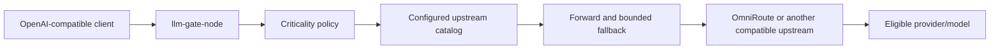

# llm-gate-node

<div align="center">
  <p><strong>TypeScript and Express middleware for capability-aware LLM request routing</strong></p>
  <p>
    
    
    
    <a href="https://github.com/mrnicholasbcarter-code/llm-gate-node/blob/master/LICENSE"></a>
  </p>
</div>

`llm-gate-node` is the TypeScript middleware implementation in the llm-gate portfolio. It accepts an Express request, classifies criticality, discovers models from a configured OpenAI-compatible upstream, rewrites the selected model, and can forward non-streaming or SSE responses through that upstream.

The default local upstream is the filtered OmniRoute proxy at `http://127.0.0.1:20132/v1`. The client framework is not special. Claude Code, Codex, Cursor, Jcode, Hermes, an Agents SDK, or a raw OpenAI-compatible client can use the gateway if they can send HTTP requests.

## Current status

This package is alpha and is not yet a production-ready transparent gateway. The current implementation provides:

- heuristic criticality classification;
- Zod request and response schemas;
- model catalog discovery from the configured upstream;
- a bounded fallback ladder for selected HTTP/network failures;
- non-streaming and SSE forwarding code paths;
- an in-memory score cache used only within the process.

It does **not** yet provide a verified Ruflo/RuVector IntelligenceService, persistent learning, reliable live quota/headroom data, full OpenAI field preservation, or a complete adversarial streaming/fallback contract. Those are tracked in the portfolio release board and must pass before publication claims are made.

## Architecture



The package does not read private `9router` or OmniRoute databases. Quota and headroom integrations must use documented APIs or remain explicitly unknown.

## Installation from source

The npm publication is not yet verified. Use a source checkout for development:

```bash
git clone https://github.com/mrnicholasbcarter-code/llm-gate-node.git
cd llm-gate-node
npm ci
npm test -- --runInBand
npm run build
```

The package boundary is checked with `npm pack --dry-run`. Development files, coverage, logs, tests, source, workflows, and generated tarballs must not ship.

## Quickstart

```typescript
import express from 'express';
import { LlmGateNode } from './dist/index.js';

const app = express();
app.use(express.json());

const gateway = new LlmGateNode({
  baseUrl: process.env.OMNIROUTE_BASE_URL ?? 'http://127.0.0.1:20132/v1',
  usageUrl: process.env.OMNIROUTE_API_BASE_URL ?? 'http://127.0.0.1:20132/api',
  apiKey: process.env.OMNIROUTE_API_KEY,
});

app.post('/v1/chat/completions', gateway.middleware(), gateway.proxy());
app.listen(3000, () => console.log('llm-gate-node listening on :3000'));
```

For local development, set `OMNIROUTE_BASE_URL` and `OMNIROUTE_API_KEY` explicitly. The gateway never invents a credential when none is configured.

## Public API

- `LlmGateNode` and the `LLMGateway` compatibility alias.
- `middleware()` for attaching a redacted routing decision to an Express request.
- `proxy()` for forwarding the request to the configured upstream.
- `OpenAIChatCompletionRequestSchema` and response schemas.
- `RoutingDecisionSchema` and its inferred TypeScript type.
- Validation helpers under `src/middleware/validator.ts`.

## Known limitations

- The criticality classifier is heuristic and is not a quality evaluator.
- The in-memory score table is not persistent learning and has no Ruflo/RuVector adapter yet.
- The upstream model catalog is not proof of live quota or health.
- Usage/headroom is fail-open when no documented provider usage adapter is configured.
- Streaming forwarding needs broader chunk-boundary, cancellation, and retry-safety tests.
- Unknown request fields and tool-call variants need a complete compatibility matrix.
- The package has no verified npm release yet.

## Verification

The current baseline is 98 Jest tests and a passing TypeScript build. The release contract additionally requires:

- raw HTTP and OpenAI client compatibility tests;
- non-streaming and arbitrary-boundary SSE fixtures;
- abort, timeout, retry legality, and upstream error tests;
- clean package installation outside the source tree;
- security and dependency checks;
- independent review of every public claim.

## Relationship to Python llm-gate

The Python and TypeScript packages are intended to share versioned routing decision and outcome contracts. They are not currently drop-in feature-equivalent implementations. The Python package is the flagship proxy specification. This package remains a TypeScript middleware path until parity is demonstrated by contract tests.

## Security

Never commit API keys, private keys, provider credentials, raw prompts, or raw completions. Use `OMNIROUTE_API_KEY` or another secret manager at runtime. See [SECURITY.md](SECURITY.md).

## License

MIT. See [LICENSE](LICENSE).
