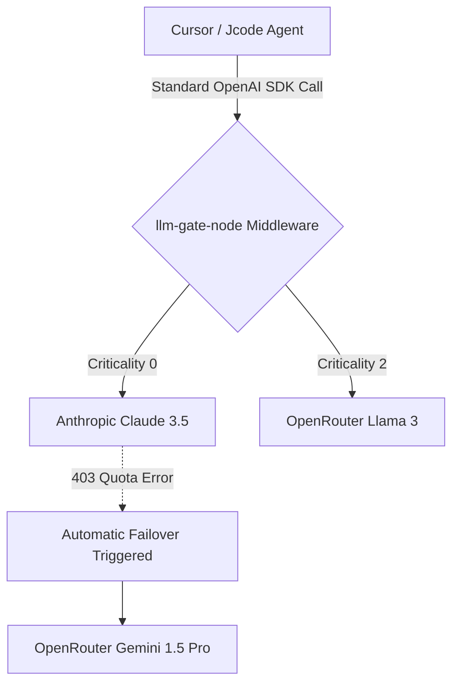

<div align="center">
  <h1>LLM-Gate: Node.js Middleware</h1>
  <p><strong>Express/TypeScript High-Availability Router for Autonomous Swarms</strong></p>
  
  
</div>

## Architecture

This Node.js middleware layer sits centrally between autonomous AI swarms and the outbound API gateways (OpenRouter, Anthropic). It seamlessly intercepts Standard OpenAI HTTP client executions and reroutes heavy structural reasoning directly to OpenRouter fallbacks if Anthropic throws a `403` or timeout.



## Quickstart

Integrate directly into your Express.js backend to wrap agent usage.

```typescript
import express from 'express';
import { LLMGateway } from '@nickhq/llm-gate-node';

const app = express();

const router = new LLMGateway({
    primaryModel: 'anthropic/claude-3-opus',
    fallbackProviders: ['openrouter']
});

// Drop-in replacement for OpenAI endpoints
app.post('/v1/chat/completions', router.expressMiddleware());
```

## Internal Testing Matrix

This project uses rigorous Jest test execution on every commit. Zod is employed extensively to validate payload signatures against hallucinated OpenAI types before forwarding to LLM endpoints.
